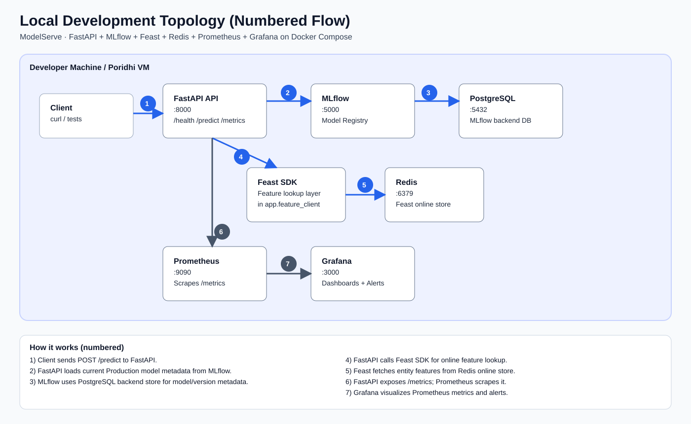
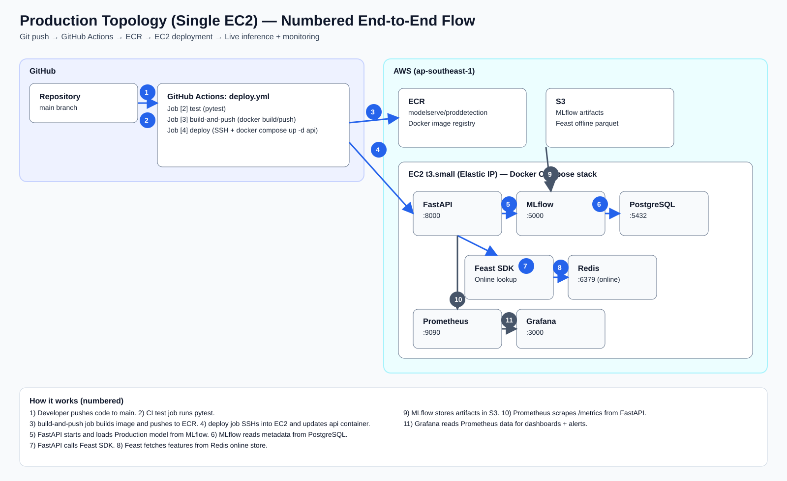

# ARCHITECTURE.md — Engineering Documentation

## ModelServe: ProdDetection Inference Platform

---

## 1. System Overview

ModelServe-ProdDetection is a production-grade ML serving platform that exposes a trained
scikit-learn model as a REST API. The system receives prediction requests, fetches
pre-computed features from a Feast-backed Redis online store, runs inference using the
Production-registered model from the MLflow Registry, and returns structured predictions
with model version metadata.

The primary design philosophy is **simplicity and reproducibility over complexity**.
Every service is containerized and the entire stack can be started locally with a single
`docker compose up`, and reprovisioned on AWS from a clean clone using a single `git push`
that triggers the CI/CD pipeline.

The audience is a small ML engineering team that needs to iterate on models quickly
while keeping the serving infrastructure reliable, observable, and auditable.

---

## 2. Architecture Diagram

### 2.1 Local Development Topology

Rendered image version (for demo):



```
┌──────────────────────────────────────────────────────────────────────────┐
│                       Developer Machine / Poridhi VM                     │
│                                                                          │
│  ┌─────────┐    ┌────────────────────────────────────────────────────┐   │
│  │ Client  │───▶│              Docker Compose Network                │   │
│  │ (curl / │    │                                                    │   │
│  │  tests) │    │  ┌──────────┐  model load  ┌──────────────────┐   │   │
│  └─────────┘    │  │ FastAPI  │◀────────────▶│     MLflow       │   │   │
│                 │  │ :8000    │              │  (tracking +     │   │   │
│  POST /predict  │  │          │              │   registry)      │   │   │
│  ─────────────▶ │  │          │              │   :5000          │   │   │
│                 │  │          │  Feast SDK   └────────┬─────────┘   │   │
│                 │  │          │◀──────────┐           │             │   │
│                 │  └──────────┘           │  ┌────────▼─────────┐   │   │
│                 │       │                 │  │   PostgreSQL     │   │   │
│                 │       │ /metrics        │  │  (MLflow DB)     │   │   │
│                 │       ▼                 │  │   :5432          │   │   │
│                 │  ┌──────────┐           │  └──────────────────┘   │   │
│                 │  │Prometheus│  ┌────────┴───────┐                 │   │
│                 │  │  :9090   │  │     Feast      │                 │   │
│                 │  └────┬─────┘  │  (feature      │                 │   │
│                 │       │        │   store SDK)   │                 │   │
│                 │  ┌────▼─────┐  └────────┬───────┘                 │   │
│                 │  │ Grafana  │           │  get_online_features     │   │
│                 │  │  :3000   │  ┌────────▼───────┐                 │   │
│                 │  └──────────┘  │     Redis      │                 │   │
│                 │                │  (online store)│                 │   │
│                 │                │   :6379        │                 │   │
│                 │                └────────────────┘                 │   │
│                 └────────────────────────────────────────────────────┘   │
└──────────────────────────────────────────────────────────────────────────┘
```

### 2.2 Production Topology (Option A — Single EC2 Node)

Rendered image version (for demo):



```
┌──────────────────────────────────────────────────────────────────────────┐
│  GitHub (github.com/Enamulitc/mlops-modelserve-capstone-exam1)           │
│                                                                          │
│  git push to main                                                        │
│       │                                                                  │
│       ▼                                                                  │
│  ┌─────────────────────────────────────────────────────────────────────┐ │
│  │  GitHub Actions CI/CD  (.github/workflows/deploy.yml)              │ │
│  │                                                                     │ │
│  │  [1] test job   ──▶  [2] build-and-push job  ──▶  [3] deploy job  │ │
│  │  pytest               docker build                SSH to EC2       │ │
│  │                       docker push ──────────────▶ docker compose  │ │
│  │                              │       ECR pull      up -d api      │ │
│  └──────────────────────────────┼────────────────────────────────────┘ │
└─────────────────────────────────┼────────────────────────────────────────┘
                                  │
              ┌───────────────────┴─────────────────┐
              │                                     │
              ▼                                     ▼
┌─────────────────────────┐          ┌──────────────────────────────────────┐
│  AWS ECR                │          │  AWS (ap-southeast-1)                │
│  modelserve/proddetect  │          │                                      │
│  (Docker image registry)│          │  ┌────────────────────────────────┐  │
└─────────────────────────┘          │  │  VPC 10.0.0.0/16               │  │
                                     │  │  Public Subnet 10.0.1.0/24     │  │
              ┌──────────────────────┘  │                                │  │
              │  image pull             │  ┌──────────────────────────┐  │  │
              ▼                         │  │  EC2 t3.small            │  │  │
┌─────────────────────────┐             │  │  (Elastic IP)            │  │  │
│  AWS S3                 │◀────────────┤  │                          │  │  │
│  mlflow-artifacts-bucket│  artifacts  │  │  ┌─────────┐ model load │  │  │
│  + Feast offline parquet│             │  │  │ FastAPI │◀──────────▶│  │  │
└─────────────────────────┘             │  │  │ :8000   │   ┌──────┐ │  │  │
                                        │  │  │         │   │MLflow│ │  │  │
                                        │  │  │         │   │:5000 │ │  │  │
                                        │  │  │  Feast  │   └──┬───┘ │  │  │
                                        │  │  │  SDK    │      │     │  │  │
                                        │  │  │    ▼    │  ┌───▼───┐ │  │  │
                                        │  │  │  Redis  │  │Postg- │ │  │  │
                                        │  │  │  :6379  │  │reSQL  │ │  │  │
                                        │  │  │(online  │  │:5432  │ │  │  │
                                        │  │  │ store)  │  └───────┘ │  │  │
                                        │  │  └────┬────┘            │  │  │
                                        │  │       │ /metrics        │  │  │
                                        │  │  ┌────▼────┐            │  │  │
                                        │  │  │Prometh. │            │  │  │
                                        │  │  │ :9090   │            │  │  │
                                        │  │  └────┬────┘            │  │  │
                                        │  │  ┌────▼────┐            │  │  │
                                        │  │  │ Grafana │            │  │  │
                                        │  │  │ :3000   │            │  │  │
                                        │  │  └─────────┘            │  │  │
                                        │  └──────────────────────────┘  │  │
                                        │  └────────────────────────────┘  │
                                        └──────────────────────────────────┘
```

> **Component summary:** FastAPI (`:8000`) · MLflow (`:5000`) · PostgreSQL (`:5432`) ·
> Feast SDK · Redis online store (`:6379`) · Prometheus (`:9090`) · Grafana (`:3000`) ·
> S3 (artifacts + offline features) · ECR (Docker images) · GitHub Actions (CI/CD)

See `docs/diagrams/` for rendered image versions of these diagrams.

---

## 3. Architecture Decision Records (ADRs)

### ADR-1: Deployment Topology — Single EC2 Node

**Context:** The exam allows any deployment topology. Options range from everything on
a Poridhi VM, to a hybrid split, to full AWS.

**Decision:** Deploy all services on a single EC2 t3.small instance provisioned by Pulumi.
S3 is used for MLflow artifact storage and Feast offline data. ECR stores Docker images.

**Rationale:** A single-node deployment is easy to reason about, debug, and bootstrap
from scratch in under 15 minutes. For a baseline capstone, the operational simplicity
outweighs availability concerns.

**Trade-offs:** Single point of failure — if the instance goes down, the entire stack
is unavailable. Resource contention between services is possible under load. In a real
production system this would be split across managed services (ECS, RDS, ElastiCache).

---

### ADR-2: CI/CD Strategy — Incremental Update (not destroy-and-recreate)

**Context:** The CI/CD pipeline needs to deploy new model API versions without
re-provisioning the entire AWS infrastructure on every push.

**Decision:** Use incremental update for the application layer — only `docker compose pull api`
and `docker compose up -d --no-deps api` is run on deploy. Pulumi infrastructure is only
re-run when infrastructure files change.

**Rationale:** Destroy-and-recreate adds ~5-10 minutes of downtime per deploy as the
EC2 instance and all services restart. Incremental update is faster and keeps the
MLflow + Postgres state intact between deploys.

**Trade-offs:** State drift is possible if Pulumi code changes are not applied.
To mitigate this, the pipeline includes a manual `pulumi up` step when infrastructure
changes are detected. Destroy-and-recreate would be preferable for fully immutable infrastructure.

---

### ADR-3: Data Architecture — Postgres + Redis + S3

**Context:** MLflow needs a backend store for metadata and an artifact store for model
files. Feast needs an online store and an offline store.

**Decision:**
- MLflow backend store: PostgreSQL (reliable, supports MLflow natively)
- MLflow artifact store: S3 (scalable, persists between sessions, decoupled from EC2)
- Feast online store: Redis (sub-millisecond latency for feature lookups at prediction time)
- Feast offline store: local Parquet files in development, S3 in production

**Rationale:** PostgreSQL is the recommended MLflow backend for production use.
Redis is the standard Feast online store — it provides the sub-millisecond feature
retrieval required at inference time. S3 ensures model artifacts and offline feature
data persist even when the EC2 instance is torn down between sessions.

**Trade-offs:** Running Postgres and Redis adds memory pressure on a t3.small.
In production, these would be replaced by RDS and ElastiCache respectively.

---

### ADR-4: Containerization — Multi-Stage Build, Non-Root User

**Context:** The exam requires the FastAPI image to be under 800 MB, run as non-root,
and use a production ASGI server.

**Decision:** Use a two-stage Dockerfile:
- Stage 1 (builder): `python:3.10-slim` with build tools, installs all pip deps into `/opt/venv`
- Stage 2 (runtime): `python:3.10-slim` with only the venv copied over, no build tools
- Runtime user: `appuser` (uid 1001, non-root)
- ASGI server: Uvicorn (lightweight, production-grade for FastAPI)

**Rationale:** Multi-stage builds eliminate build tools (gcc, build-essential) from the
final image, reducing size significantly. `python:3.10-slim` is preferred over `python:3.10`
because it excludes unnecessary OS packages. Non-root execution limits the blast radius
of any container escape vulnerability.

**Trade-offs:** Uvicorn without Gunicorn means no worker process management — for higher
concurrency, Gunicorn + Uvicorn workers would be added. The image is approximately 600-700 MB.

---

### ADR-5: Monitoring Design — Three Alert Rules, Provisioned Grafana

**Context:** The exam requires Prometheus alerts and a Grafana dashboard that renders
automatically after `docker compose up`.

**Decision:**
- Three alert rules: FastAPIDown (service-down), HighPredictionLatency (p95 > 500ms),
  HighPredictionErrorRate (> 5% error rate)
- Dashboard panels: latency p50/p95/p99, request rate (success vs error), error rate %,
  Feast hit/miss ratio, current model version
- Grafana provisioning via YAML files — no manual UI setup required

**Rationale:** The three alert rules cover the three most critical failure modes:
complete outage, degraded performance, and high error rate. The 500ms p95 threshold
is a reasonable starting point for a non-latency-critical ML API. Grafana provisioning
ensures reproducibility — the dashboard is always present after a fresh `docker compose up`.

**Trade-offs:** The alert thresholds are not calibrated to real traffic data — they are
reasonable defaults. In production, thresholds would be tuned based on observed baselines.
The dashboard does not yet include infrastructure metrics (CPU, memory, disk).

---

## 4. CI/CD Pipeline Documentation

**File:** `.github/workflows/deploy.yml`

### Jobs

| Job | Trigger | What it does |
|-----|---------|--------------|
| `test` | Every push + PR | Installs deps, runs `pytest app/tests/` with coverage |
| `build-and-push` | Push to `main` (after test) | Builds Docker image, pushes to ECR with `$GITHUB_SHA` and `latest` tags |
| `deploy` | Push to `main` (after build) | SSH into EC2, `git pull`, ECR login, `docker compose pull api`, `docker compose up -d --no-deps api`, health check |

### Secrets Required

| Secret | Description |
|--------|-------------|
| `AWS_ACCESS_KEY_ID` | AWS credentials for ECR push + deployment |
| `AWS_SECRET_ACCESS_KEY` | AWS credentials |
| `DEPLOY_HOST` | EC2 public IP (Elastic IP) |
| `DEPLOY_USER` | SSH username (e.g. `ubuntu`) |
| `DEPLOY_SSH_KEY` | Private SSH key for EC2 access |

### Failure Handling
- If `test` fails, `build-and-push` and `deploy` are skipped entirely.
- If `build-and-push` fails, `deploy` is skipped.
- Health check (`curl --retry 10`) at the end of `deploy` verifies the new version is live.

### Expected end-to-end deploy time: ~5–8 minutes

---

## 5. Runbook

### 5.1 Bootstrap from a fresh clone

```bash
# 1. Clone the repository
git clone https://github.com/Enamulitc/mlops-modelserve-capstone-exam1.git
cd mlops-modelserve-capstone-exam1

# 2. Copy and configure environment variables
cp .env.example .env
# Edit .env — fill in passwords, AWS credentials, ECR registry

# 3. Place your dataset
# Copy dataset.csv to training/data/dataset.csv

# 4. Start the local stack
docker compose up -d

# 5. Train the model (runs against the local MLflow at :5000)
pip install -r requirements.txt
python training/train.py

# 6. Materialise features into Redis
cd feast_repo
feast apply
feast materialize-incremental $(date -u +"%Y-%m-%dT%H:%M:%S")

# 7. Test the API
curl http://localhost:8000/health
curl -X POST http://localhost:8000/predict \
     -H "Content-Type: application/json" \
     -d @training/sample_request.json
```

### 5.2 Deploy a new model version without restarting the full stack

```bash
# Train a new model version (registers as new version in MLflow, promotes to Production)
python training/train.py

# The FastAPI service loads the model on startup — restart only the api container
docker compose restart api

# Or trigger via git push (CI/CD handles this automatically)
git commit -m "retrain: new model version"
git push origin main
```

### 5.3 Diagnosing common failures

| Symptom | Likely cause | Resolution |
|---------|-------------|------------|
| `api` exits on startup | MLflow not ready yet | Wait for MLflow healthcheck; check `docker compose logs mlflow` |
| Predictions return 500 | No Production model in MLflow | Run `python training/train.py` |
| Feast lookup always misses | Features not materialised | Run `feast materialize-incremental <timestamp>` in `feast_repo/` |
| Grafana shows no data | Datasource UID mismatch | Check `provisioning/datasources/prometheus.yml` UID matches dashboard JSON |
| `pulumi destroy` fails | ECR has images | `force_delete=True` is set — re-run `pulumi destroy --yes` |
| S3 permission denied | IAM role missing | Verify EC2 instance profile has `AmazonS3FullAccess` |

### 5.4 Teardown

```bash
# Stop local stack
docker compose down -v

# Destroy AWS resources
cd infrastructure/pulumi
pulumi destroy --yes
```

---

## 6. Known Limitations

1. **Single node deployment** — the entire system is a single point of failure.
   A production system would use ECS/EKS with auto-scaling, RDS for Postgres, and ElastiCache for Redis.

2. **Model loaded at startup only** — a model hot-reload mechanism (without container restart)
   is not implemented. This means deploying a new model version requires a container restart (~5s downtime).

3. **No authentication on the API** — `/predict` is open to the public. In production,
   API key or JWT authentication would be required.

4. **Feast entity coverage** — entities not yet materialised in Redis fall back to raw
   features from the request body. This fallback is not logged or alerted on.

5. **No request input validation beyond Pydantic** — malformed or out-of-distribution
   feature values are passed directly to the model without schema enforcement.

6. **No model performance drift monitoring** — Prometheus tracks latency and error rate
   but not prediction distribution shift. A real system would add data drift detection
   (e.g., Evidently AI).

7. **Alert thresholds are defaults** — the 500ms p95 threshold and 5% error rate threshold
   are not calibrated to actual traffic. They should be tuned after observing baseline metrics.
